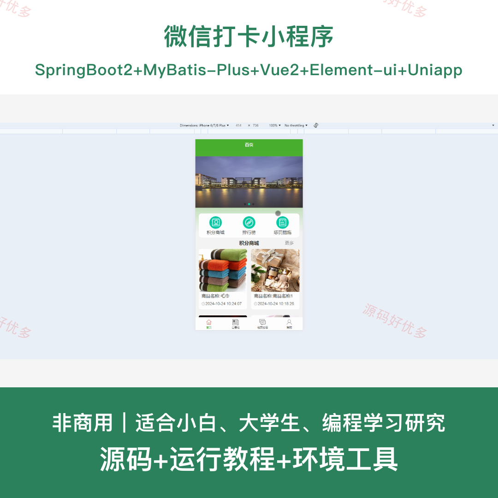
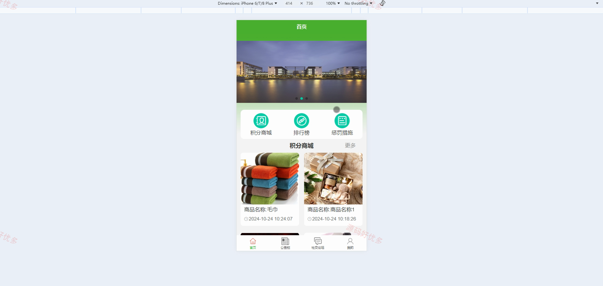
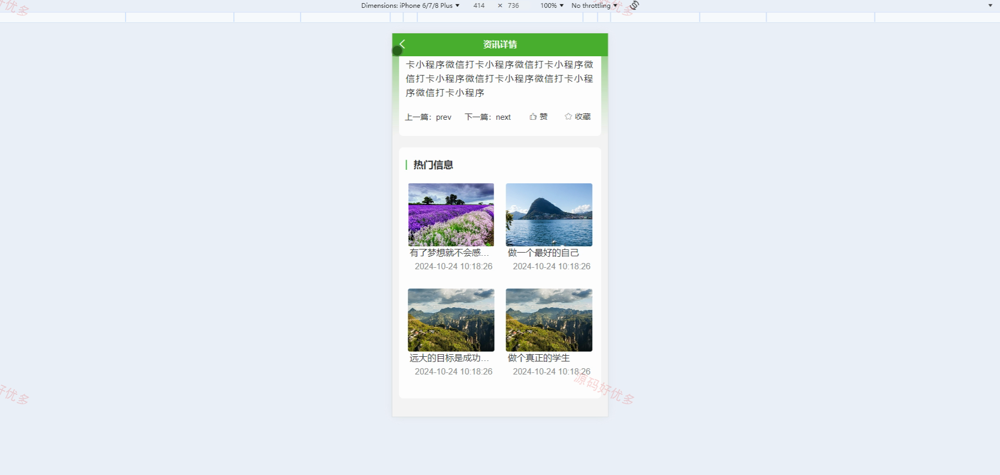
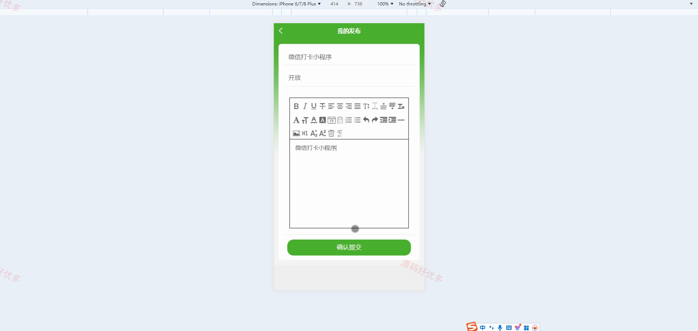
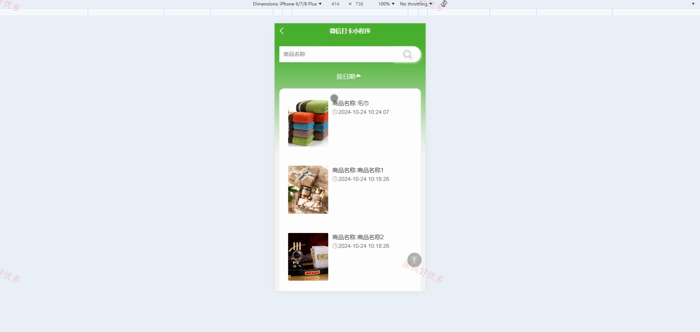
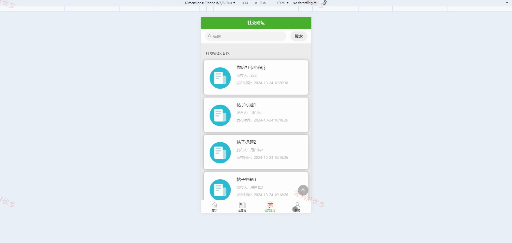
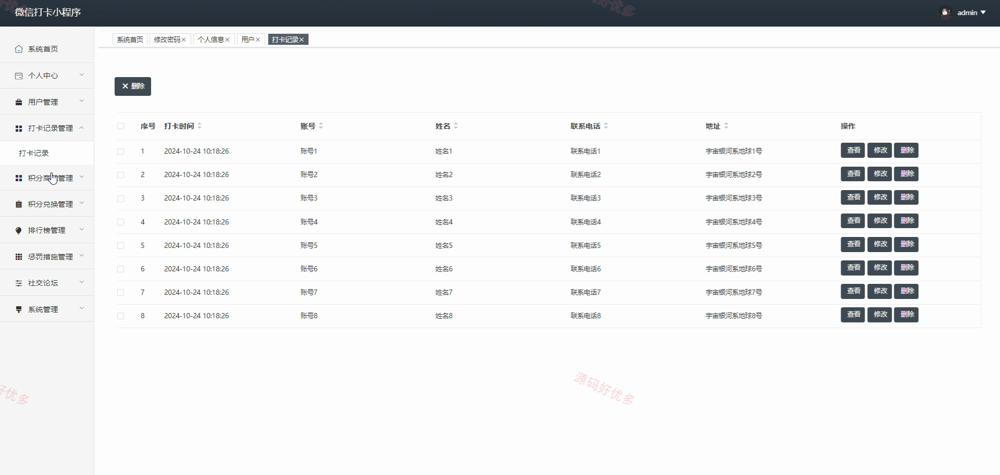
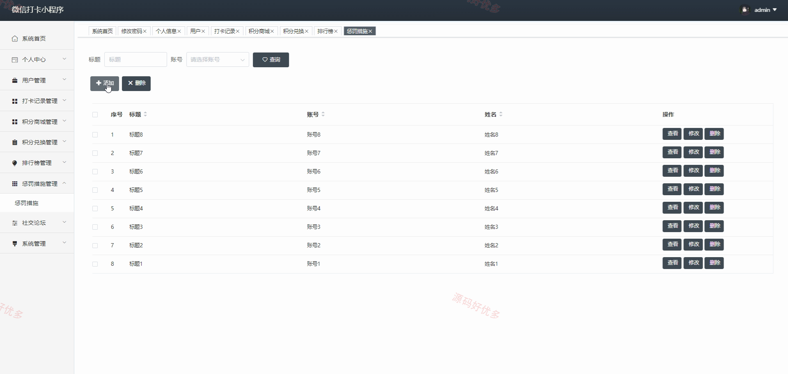
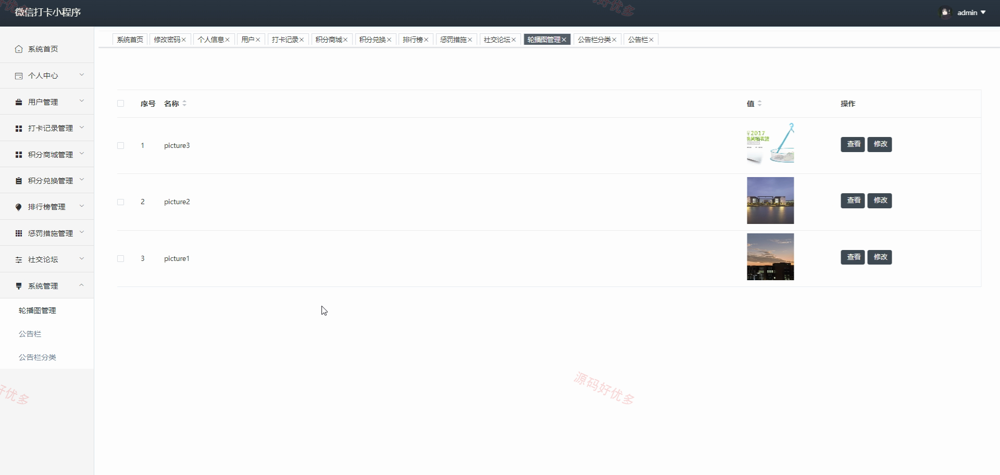

# mpweixinA257D
mpweixinA257D微信打卡小程序
## 源码问题查看主页咨询

### 一、关键词
微信打卡、积分兑换、打卡排行、惩罚措施、社交论坛

### 二、作品包含
源码+数据库+全套环境和工具资源+本地部署教程

### 三、项目技术
前端技术： Html、Css、Js、Vue2.6、Element-ui、uniapp
后端技术：Java、SpringBoot2.2.2、MyBatis-Plus

### 四、运行环境（以下版本亲测，其他版本兼容性请自行测试）
开发工具：IDEA/eclipse + VSCODE + HBuilder X + 微信开发者工具

数据库：MySQL5.7+（共13张表）

数据库管理工具：Navicat10以上版本

环境配置软件： JDK1.8 + Maven3.6.3

前端Nodejs：14+

浏览器：谷歌浏览器

### 五、项目介绍
项目编号：mpweixinA257D

本项目面向日常目标打卡场景，用户可在微信小程序中记录打卡、查看排行榜与惩罚措施，并使用积分兑换商品、参与论坛交流。管理员在后台统一维护用户、打卡记录、积分商城、排行榜、惩罚措施、论坛和公告信息。

角色：用户、管理员

用户功能：小程序登录注册、个人资料维护、打卡记录新增与查看、积分商城浏览与兑换、打卡排行查看、惩罚措施查看、论坛发布与回复、收藏管理。

管理员功能：后台登录、用户管理、打卡记录管理、积分商城管理、积分兑换管理、排行榜管理、惩罚措施管理、论坛与公告管理。

### 六、运行截图

